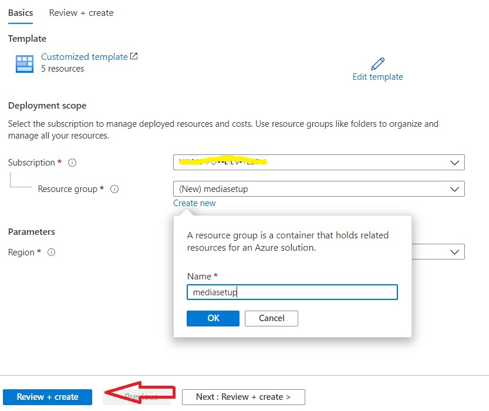
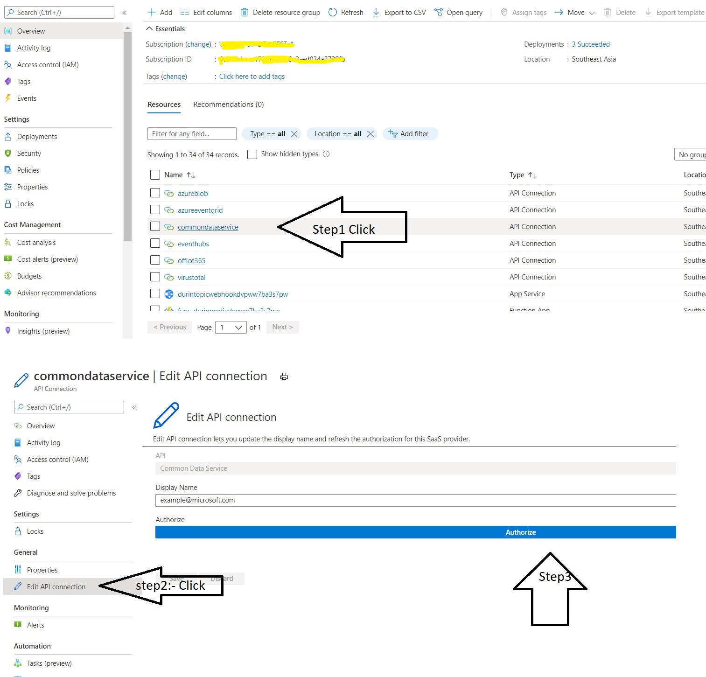
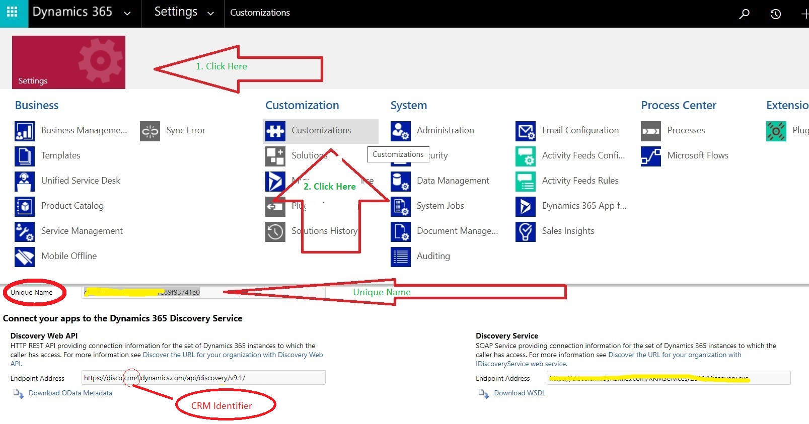
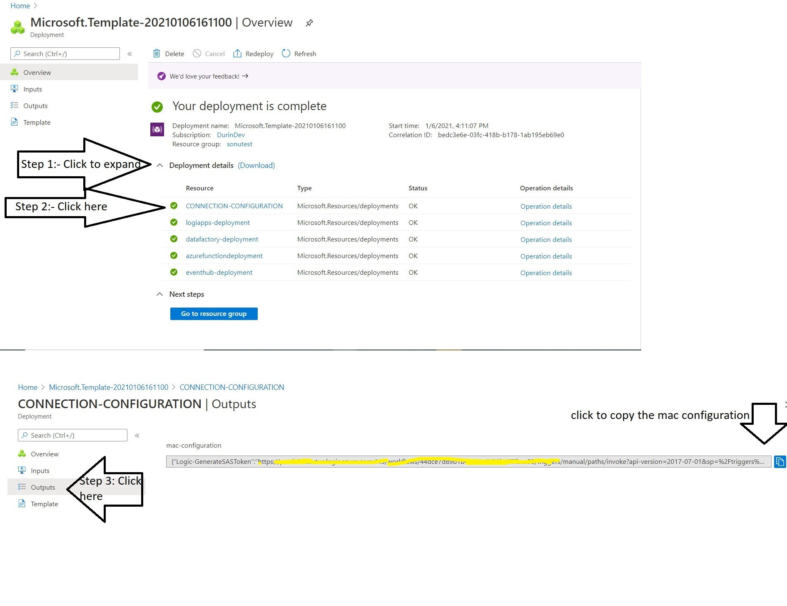

## Durin Media Azure Deployment Guide

### Prerequisite
* CDS tenant Admin Credential
* Azure Credential with Deployment permission
* Virus Total Api Key. Check out [how to get api key](docs/VirusTotalScan.md)

### Deploy Connections
Click below to deploy connection objects in the azure. Once you click on the button below, you will be redirected to azure portal. Please select the subscription and resource group(prefer to create new), click on review + create, then hit on create button. Sooner the deployment will start for connection objects. Now wait unless it completes. See the attached image for the reference.

### Authorize connections
Once the deployment of connection completes, you should see <b>"Go to resource group" </b> Button. Click on that button, it should take you to page where all created object will listed. follow below steps
* See the <b>commmondataservice</b> connection. click on it-> see at left pane-> click on Edit Api connection  -> Authorize-> enter cds tenant admin credential. After successfull authentication, Please save. See the attached image.
* Similarly select <b>azureeventgrid</b>-> Edit Api Connection -> Authorize with you own Azure logged-in credential.
* Same with <b>office365</b>. Please authorize with the user credential which can be use for sending Emails.
* Same with <b>Virustotal</b>. Please authorize with "x-api_key". Check out [Virus Total Doc](docs/VirusTotalScan.md) for api key.

### Deploy Azure components

Click the below button, it will again  redirect you to azure portal, Please select the <b>same subscription and resource group</b> and enter the CDS Org Unique name as well as Crm Identifier.
 * <b> Unique Name:- Unique name can be found in your CDS tenant(login to cds) -> Setting-> Customization -> Developer Resource -> Unique name. Attached the image for the reference </b>
 * <b>CRM Identifier:- Look at the Endpoint Address, it would be some thing like https://disco.crm4.dynamics.com/api/discovery . Crm4 is Crm Identifier here</b>. 

### Mac Client Connection configuration

Once the azure component deployment completes, <b> Expand the Deployment details Section ->  Click on the CONNECTION-CONFIGURATION -> Left pane "output link" -> Copy the MAC configuration </b>. you will need this configuration, while setting up your Mac Client.

<b> The MAC Config is needed for mac client setup</b>

